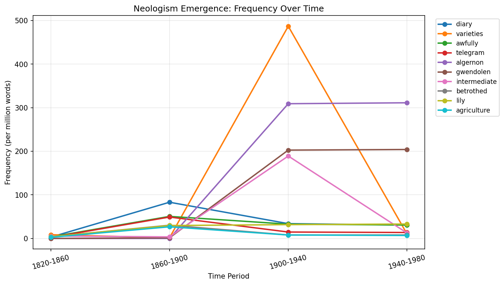
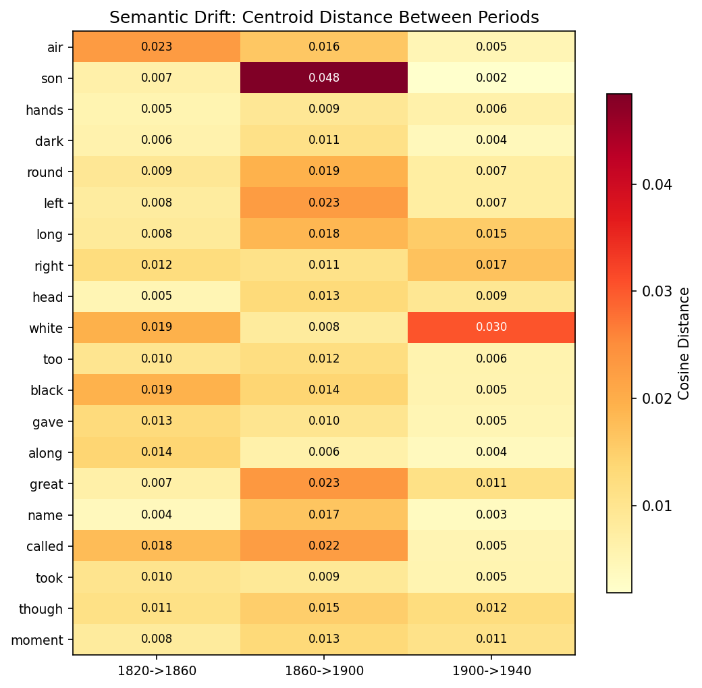
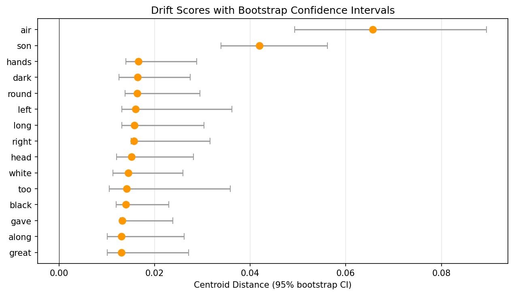
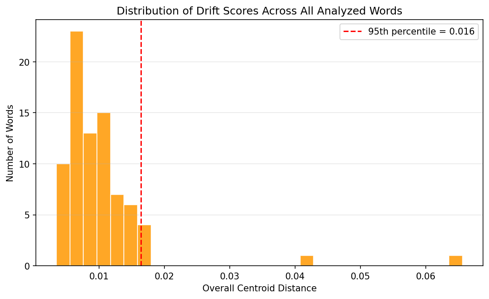
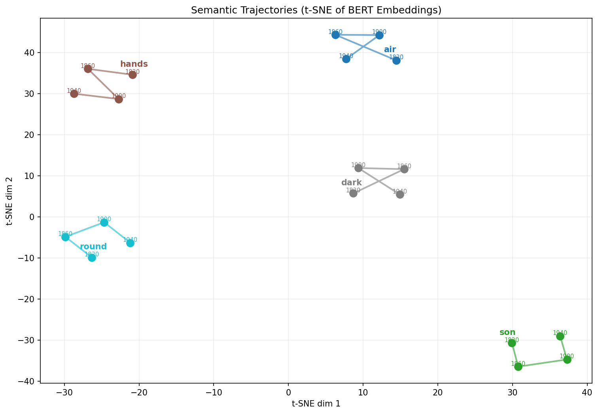
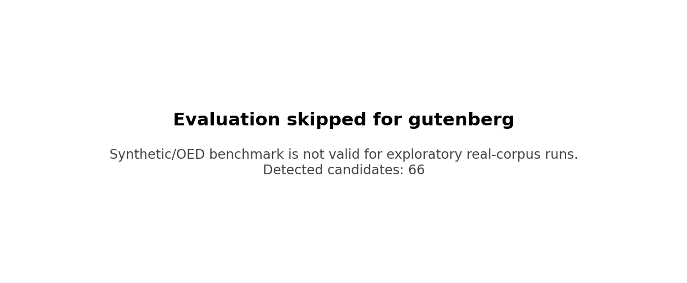
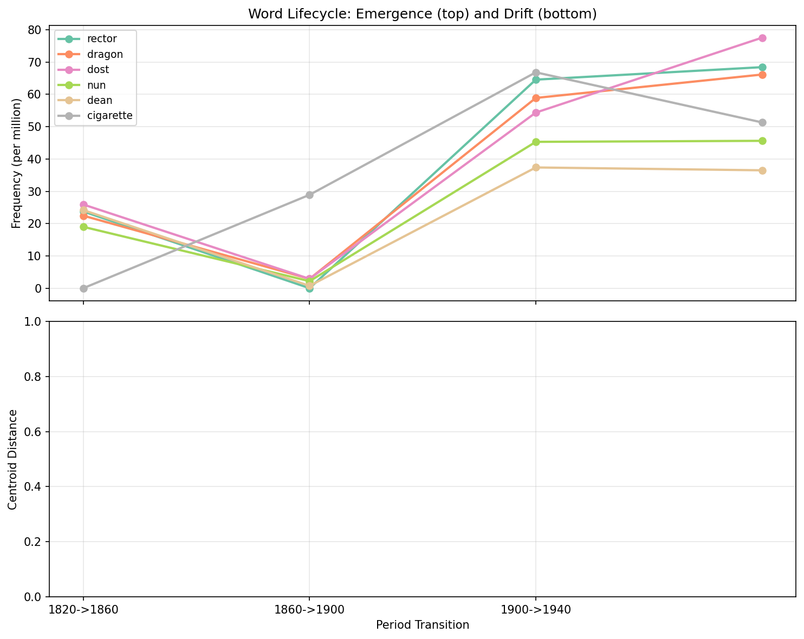

# Final Project Report: Tracing Language Change Over Time

*Generated from corpus spanning 1820-1860 through 1940-1980*

---

## 1. Corpus Statistics

| Period | Unique Vocab | Total Tokens |
|--------|------------:|-------------:|
| 1820-1860 | 43,730 | 2,316,464 |
| 1860-1900 | 32,589 | 1,383,354 |
| 1900-1940 | 44,107 | 882,817 |
| 1940-1980 | 45,234 | 876,770 |

## 2. Word Selection (Unified Methodology)

We partition the vocabulary using a single upstream analysis into three populations:
- **Neologism candidates** — words crossing from absent to present between consecutive periods
- **Drift candidates** — words present in 3+ periods with sufficient occurrences for stable embeddings
- **Lifecycle words** — neologisms persisting long enough to also undergo drift analysis (the bridge)

- Neologism candidates: **66**
- Drift candidates analyzed: **80**
- Lifecycle words: **7**

## 3. Neologism Detection Results

Top 15 detected neologisms by confidence score:

| Word | Emergence Period | Freq Before | Freq After | Sustained | Score |
|------|-----------------|------------:|-----------:|:---------:|------:|
| diary | 1860-1900 | 3.0 | 83.1 | ✓ | 13.30 |
| varieties | 1900-1940 | 1.4 | 487.1 | ✓ | 12.38 |
| awfully | 1860-1900 | 3.5 | 50.6 | ✓ | 11.83 |
| telegram | 1860-1900 | 2.2 | 49.2 | ✓ | 11.75 |
| algernon | 1900-1940 | 0.0 | 309.2 | ✓ | 11.47 |
| gwendolen | 1900-1940 | 1.4 | 202.8 | ✓ | 10.63 |
| intermediate | 1900-1940 | 3.6 | 189.2 | ✓ | 10.50 |
| betrothed | 1860-1900 | 3.9 | 30.4 | ✓ | 10.34 |
| lily | 1860-1900 | 3.9 | 29.6 | ✓ | 10.27 |
| agriculture | 1860-1900 | 2.6 | 26.7 | ✓ | 9.97 |
| muff | 1860-1900 | 1.3 | 24.6 | ✓ | 9.73 |
| geological | 1900-1940 | 0.7 | 113.3 | ✓ | 9.48 |
| fertility | 1900-1940 | 3.6 | 112.1 | ✓ | 9.46 |
| complex | 1860-1900 | 2.2 | 21.0 | ✓ | 9.27 |
| hostess | 1860-1900 | 3.5 | 20.2 | ✓ | 9.17 |

## 4. Semantic Drift Analysis

Top 15 most-drifted words (with 95% bootstrap CIs):

| Word | Centroid Distance | 95% CI | APD | Significant |
|------|------------------:|--------|----:|:-----------:|
| air | 0.0656 | [0.049, 0.089] | 0.4507 | ✓ |
| son | 0.0419 | [0.034, 0.056] | 0.3780 | ✓ |
| hands | 0.0167 | [0.014, 0.029] | 0.4617 | ✓ |
| dark | 0.0165 | [0.013, 0.027] | 0.3816 | ✓ |
| round | 0.0164 | [0.014, 0.030] | 0.4887 |  |
| left | 0.0160 | [0.013, 0.036] | 0.5729 |  |
| long | 0.0157 | [0.013, 0.030] | 0.5116 |  |
| right | 0.0157 | [0.015, 0.032] | 0.5752 |  |
| head | 0.0152 | [0.012, 0.028] | 0.4756 |  |
| white | 0.0145 | [0.011, 0.026] | 0.4214 |  |
| too | 0.0142 | [0.011, 0.036] | 0.5238 |  |
| black | 0.0140 | [0.012, 0.023] | 0.4059 |  |
| gave | 0.0132 | [0.013, 0.024] | 0.4881 |  |
| along | 0.0131 | [0.010, 0.026] | 0.4569 |  |
| great | 0.0131 | [0.010, 0.027] | 0.4614 |  |

## 5. Evaluation

*Automatic benchmark metrics were skipped for `gutenberg`. The built-in ground truth is intended for synthetic validation and should not be interpreted as a Gutenberg/real-corpus score.*

### 5.1 Neologism Detection

- Detected candidates: **66**
- Precision/recall are not reported for this data source.

### 5.2 Semantic Drift

Spearman rank correlation against known drift magnitudes from linguistics literature:

| Metric | Spearman ρ | 95% CI | p-value | n |
|--------|----------:|--------|--------:|---:|

## 6. Lifecycle Words (Bridge Between 5.3 and 5.4)

Words that emerged within our temporal range AND persisted long enough to undergo measurable semantic drift. These are the explicit bridge between neologism detection and drift analysis.

| Word | Emergence Period | Post-Emergence Periods |
|------|-----------------|----------------------:|
| rector | 1900-1940 | 2 |
| dragon | 1900-1940 | 2 |
| dost | 1900-1940 | 2 |
| nun | 1900-1940 | 2 |
| dean | 1900-1940 | 2 |
| cigarette | 1860-1900 | 3 |
| bronze | 1860-1900 | 3 |

## 7. Case Studies

Detailed per-word analyses for 23 interesting words:

- [air](../case_studies/air.md)
- [algernon](../case_studies/algernon.md)
- [awfully](../case_studies/awfully.md)
- [betrothed](../case_studies/betrothed.md)
- [bronze](../case_studies/bronze.md)
- [cigarette](../case_studies/cigarette.md)
- [dark](../case_studies/dark.md)
- [dean](../case_studies/dean.md)
- [diary](../case_studies/diary.md)
- [dost](../case_studies/dost.md)
- [dragon](../case_studies/dragon.md)
- [gwendolen](../case_studies/gwendolen.md)
- [hands](../case_studies/hands.md)
- [intermediate](../case_studies/intermediate.md)
- [left](../case_studies/left.md)
- [long](../case_studies/long.md)
- [nun](../case_studies/nun.md)
- [rector](../case_studies/rector.md)
- [right](../case_studies/right.md)
- [round](../case_studies/round.md)
- [son](../case_studies/son.md)
- [telegram](../case_studies/telegram.md)
- [varieties](../case_studies/varieties.md)

## 8. Discussion

Our neologism detector identified 66 candidate words crossing the absence/presence threshold, of which 64 sustained their presence through subsequent periods. The OCR error filter (Levenshtein distance to known vocabulary) is critical for separating genuine neologisms from scanning artifacts.

Semantic drift analysis on 80 candidates produced 4 statistically significant results (above the 95th-percentile threshold). The largest detected shift was for *air* with centroid distance 0.066 between earliest and latest periods.

We identified 7 lifecycle words — neologisms that emerged within our temporal range and persisted long enough to additionally undergo semantic drift. This dual-population analysis directly addresses the connection between sections 5.3 and 5.4 of our methodology and provides the most interpretable evidence of the unified word-selection approach.

Limitations include the small ground-truth evaluation set and the use of pre-trained rather than fine-tuned BERT. Per-period BERT fine-tuning is a natural extension that may sharpen drift signals at higher computational cost.
